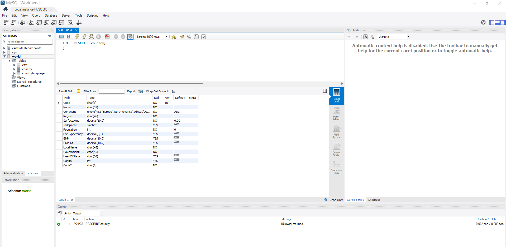
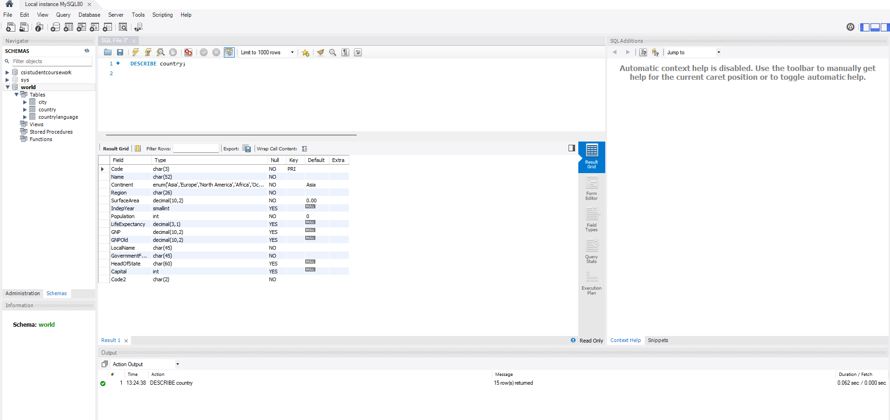
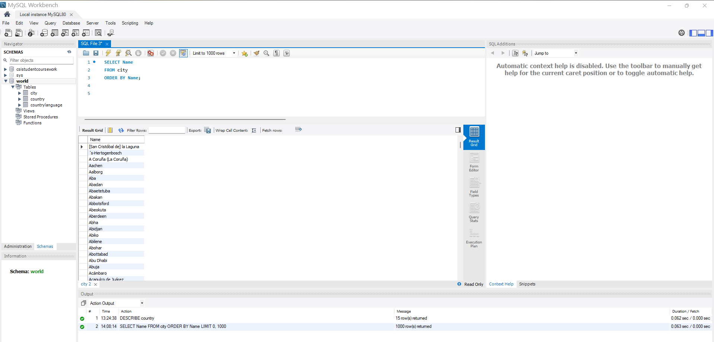
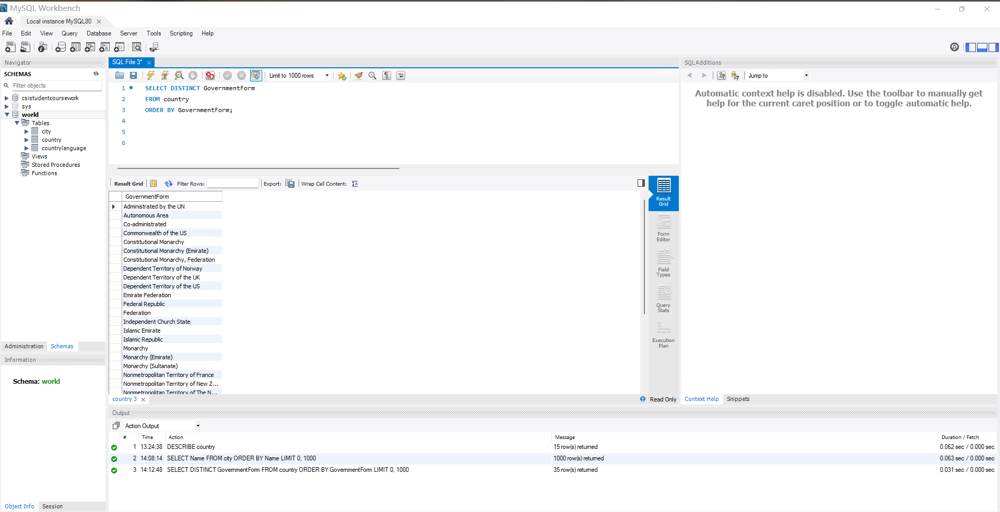
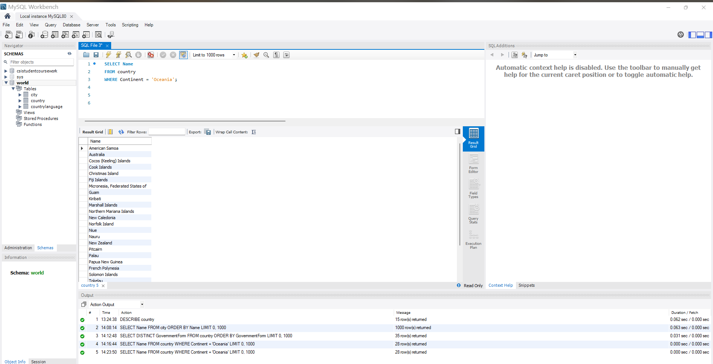
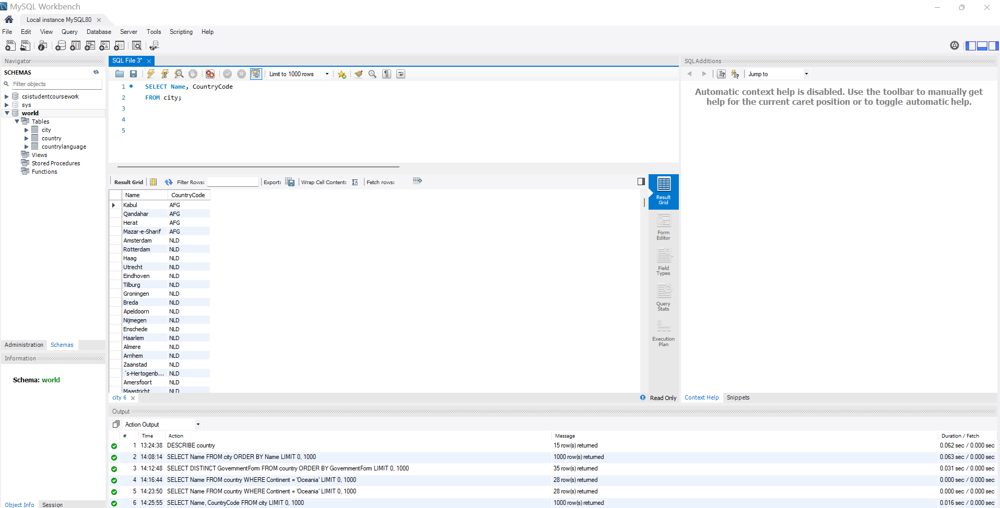
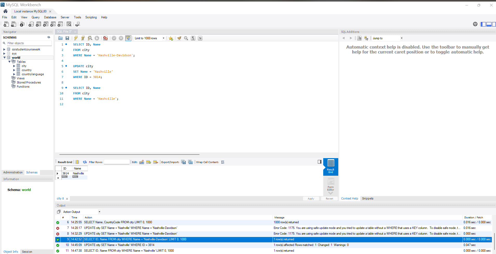
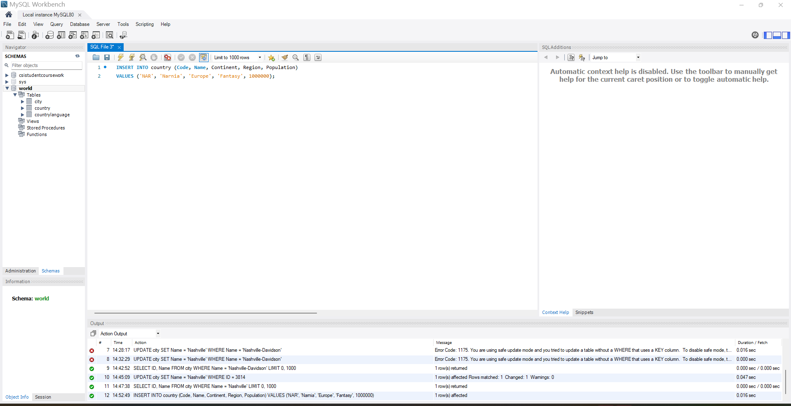
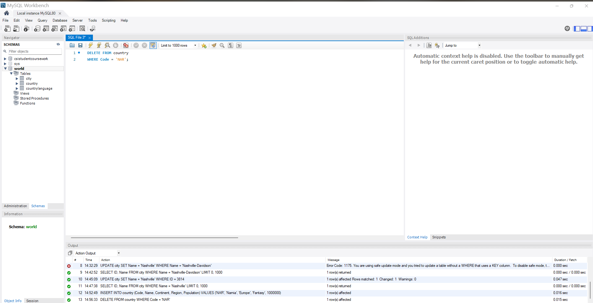

# Exercise 01: World Database SQL Practice

- Name: Sandra Otubushin
- Course: Database for Analytics
- Module: 1
- Database Used: World Database

---

## Instructions

- Answer each question below.
- All SQL commands **must be executed** against the World database.
- For each SQL command:
  - Include the SQL in a fenced code block
  - Include a **screenshot** showing the command and results
- Store screenshots in the `screenshots/` folder and embed them below each answer.

---

## Question 1

**Compare and contrast the data types used for:**
- `country.Population`
- `country.LifeExpectancy`

Why were these data types selected?

### Answer
_Write your explanation here._
country.Population is INT
Population is a whole-number count of people (you don’t have 12.5 people), so an integer type makes sense. INT is also efficient and supports very large values, which is useful because some countries have populations in the tens or hundreds of millions.

country.LifeExpectancy is DECIMAL(3.1)
Life expectancy is often measured with one decimal place (example: 78.4 years). Using DECIMAL(3.1) stores values like 0.0 to 999.9 precisely without floating-point rounding errors. This is ideal for a metric where accuracy and consistent formatting matter.
### Screenshot
_Show the table structure or DESCRIBE output._

```sql
DESCRIBE country;
```



---

## Question 2

**What is the data type of `country.IndepYear`?**
Why do you think this data type was selected?

### Answer
_Write your explanation here._country.IndepYear is SMALLINT
A year value fits easily into a SMALLINT and takes less storage than an INT. It also makes sense because independence years are typically within a reasonable numeric range (ex: 1700–2025). The column is also allowed to be NULL, which is useful for countries/territories that may not have an independence year.

### Screenshot

```sql
DESCRIBE country;
```



---

## Question 3

**Make a case for a different data type for `country.IndepYear`.**
Explain why your proposed data type might be better in some situations.

### Answer
_Write your explanation here._
A good alternative could be YEAR (MySQL YEAR type)
Why it might be better:
It clearly communicates that the value represents a year (more semantically meaningful than a generic number).
It can enforce valid year formatting more naturally.
It makes the data easier to understand and validate in tools and reports.

When SMALLINT might still be better:
If you want to store years outside MySQL YEAR supported ranges, or
If you want to store special numeric values (like placeholders) — though that’s usually not recommended.
---

## Question 4

Write a SQL command to **list the names of all cities in alphabetical order**.

### SQL

```sql
SELECT Name
FROM city
ORDER BY Name;
```

### Screenshot


q4_cities_sorted
---

## Question 5

Write a SQL command to **list all forms of government from the `country` table**, showing **each only once**, sorted alphabetically.

### SQL

```sql
SELECT DISTINCT GovernmentForm
FROM country
ORDER BY GovernmentForm;
```

### Screenshot


---

## Question 6

Write a SQL command to **list all countries in the `Oceania` continent**.

### SQL

```sql
SELECT Name
FROM country
WHERE Continent = 'Oceania';
```

### Screenshot


---

## Question 7

Write a SQL command to **list the names and country code of all cities**.

### SQL

```sql
SELECT Name, CountryCode
FROM city;
```

### Screenshot


---

## Question 8

Write a SQL command to **update the city named `"Nashville-Davidson"` to `"Nashville"`**.

### SQL

```sql
UPDATE city
SET Name = 'Nashville'
WHERE Name = 'Nashville-Davidson';
```

### Screenshot



---

## Question 9

Write a SQL command to **insert a new country named `"Narnia"`** with a country code of `"NAR"`.
Use reasonable values for the remaining columns.

### SQL

```sql
INSERT INTO country (Code, Name, Continent, Region, Population)
VALUES ('NAR', 'Narnia', 'Europe', 'Fantasy', 1000000);
```

### Screenshot



---

## Question 10

Write a SQL command to **delete the country with the country code `"NAR"`**.

### SQL

```sql
DELETE FROM country
WHERE Code = 'NAR';
```

### Screenshot


